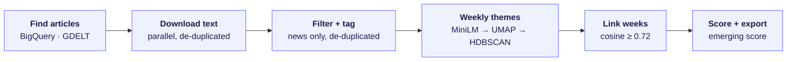
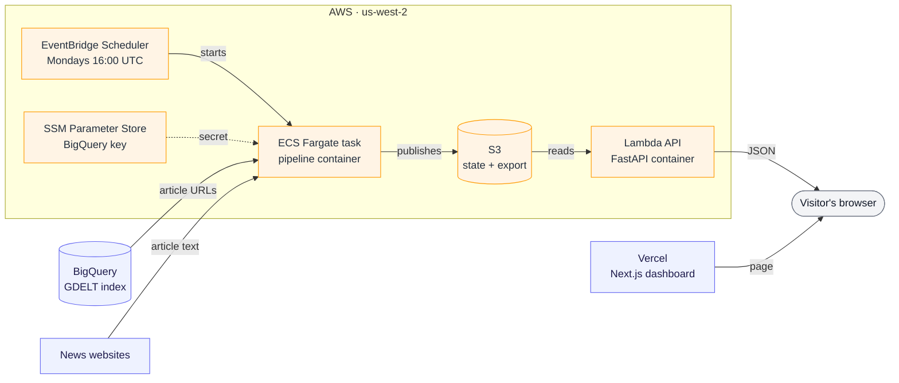
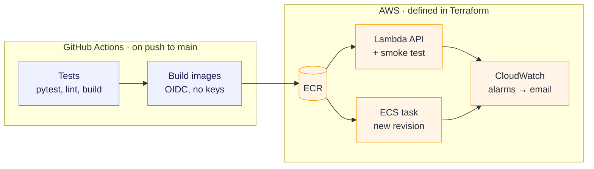

# MarketThemeAI

**Discovering emerging AI and semiconductor market themes from the news, without telling the model what to look for.**

🔗 **Live dashboard:** [market-theme-ai.vercel.app](https://market-theme-ai.vercel.app/) · **API:** [`/health`](https://bgijyqkoldokts5mrzp5fqnfku0voche.lambda-url.us-west-2.on.aws/health), [`/stats`](https://bgijyqkoldokts5mrzp5fqnfku0voche.lambda-url.us-west-2.on.aws/stats)


---

## Why I built this

Anyone following the AI and chip industry is buried in news. Every week brings hundreds of articles about NVIDIA, TSMC, export controls, HBM memory, datacenter buildouts, and the stories that actually matter tend to show up as a *cluster* of coverage before they become an obvious headline.

Most tools for tracking this are keyword searches: you decide in advance that "advanced packaging" is a theme, and the tool counts mentions. That only finds what you already knew to look for.

MarketThemeAI takes the opposite approach. It reads each week's news, groups articles by **meaning** rather than keywords, and lets the themes emerge from the data. It then follows those themes week to week to answer:

- **What's new?** Themes that didn't exist last week.
- **What's growing?** Themes getting more coverage than before.
- **What's continuing or fading?** Stories that persist or lose attention.

## What it does

| | |
|---|---|
| **Corpus** | 8,000+ English news articles from global coverage via GDELT, filtered to ~2,900 industry-news articles |
| **Coverage** | 60 companies across 13 industry groups (AI compute, foundry, memory, equipment, networking, EDA, packaging, …) |
| **Output** | 163 themes across 14 weeks, each titled by its most representative headline, linked to its history, and scored for "emergingness" |
| **Dashboard** | Summary stats, the hottest theme, filters for emerging / new / continuing themes, and theme trajectories over time |

## How it works



`python -m src.pipeline` runs every step in order; embeddings are cached so each weekly run only processes new articles.

## Key decisions

**GDELT through BigQuery instead of a news API.**
I started with GDELT's public API, but kept hitting rate limits and pulling in large amounts of noise. Its full index is available in BigQuery, so I query it there. That gives one SQL query with filtering by company, topic, and language before anything is downloaded, plus far more coverage than commercial news APIs offer for free.

**English-only.**
Embedding a mixed-language corpus risks clusters that split by *language* rather than *topic*. Restricting to English keeps clusters about the story, not the language it was written in.

**A curated company universe, but themes are not predefined.**
`data/company_universe.csv` lists the companies I care about, grouped into industry segments. It's used to filter out irrelevant articles and to explain each theme ("this cluster is mostly NVIDIA + TSMC → AI compute + foundry"). The groups never *define* the themes, though. Themes come purely from clustering, so the system can surface stories I didn't anticipate.

**Small, fast embeddings (`all-MiniLM-L6-v2`).**
Each article is embedded from its title plus the opening of the body. MiniLM runs on a laptop CPU for thousands of articles without a GPU, which keeps the pipeline cheap enough to rerun every week. A larger model is an easy swap later if topic separation needs to improve.

**Industry news, not stock commentary.**
Most of the raw corpus mentions the right companies without being about the industry: stock-picking columns, automated holdings filings, earnings-call transcripts, daily market wraps, and the same wire story syndicated across a dozen sites. Left in, they formed most of the "themes" (one site's "stocks to buy" format every week, 17 copies of one Dow headline). The filter drops those formats by headline pattern, catches investment-commentary publishers syndicated under other domains (mostly Yahoo) by their disclosure footers, removes duplicate headlines, and requires the company or a chip/AI term in the headline or opening paragraph, not just anywhere in the text. Every dropped article is counted by reason in the run logs.

**HDBSCAN instead of k-means.**
The number of themes changes every week, and many articles don't belong to any theme. k-means would force me to pick *k* and assign every article somewhere. HDBSCAN finds however many dense clusters actually exist and labels the rest as noise, which matches how news really behaves.

**UMAP before HDBSCAN.**
Density is close to meaningless in 384 dimensions. Run directly on the embeddings, HDBSCAN either discarded about 70% of articles as noise or, once duplicates were removed, merged a whole week into one 300-article blob. Reducing to 5 dimensions with UMAP first (the approach BERTopic popularized) puts about 80% of filtered articles into themes. A theme must also be covered by at least 3 different outlets, which rules out one site's recurring format.

**Headlines as titles, keyphrases as tags.**
Keyword labels ("beats · beats forecasts · expansion") were the least readable part of the dashboard. Each theme is now titled by the headline closest to its centroid, the way news aggregators do it. The tags come from class-based TF-IDF, which picks terms frequent in that theme but rare in the week's other themes ("musk, elon, terafab") instead of terms that are merely common.

**Cluster week by week, then link.**
Clustering all articles at once would blur time. Instead, each week is clustered independently, and themes are connected across weeks when their centroid embeddings have cosine similarity ≥ 0.72. This makes "new", "growing", and "fading" concrete, measurable ideas instead of guesses.

**Start static, then add an API.**
The first version exported JSON that the dashboard read directly: free to host, nothing to keep running, right for a prototype. Moving the data behind an API decoupled the two. The weekly refresh no longer needs a frontend redeploy, and the data can be queried by week, company, or status instead of shipped as one file.

## Tech stack

**Data & ML:** Python, BigQuery (GDELT), trafilatura, sentence-transformers, UMAP, HDBSCAN, scikit-learn (class-based TF-IDF), NumPy  
**Frontend:** Next.js, React, TypeScript, Tailwind CSS, deployed on Vercel  
**API:** FastAPI, uvicorn  
**Infrastructure:** Docker, AWS (ECS Fargate, Lambda, S3, ECR, EventBridge Scheduler, IAM, SSM, CloudWatch, SNS), Terraform, GitHub Actions

## Current limitations

Being honest about what isn't solved yet:

- **Some stock commentary still forms themes.** Headline rules and publisher detection remove most of it, but loosely worded investor pieces ("Here's What Could Send Nvidia Stock to New All-Time Highs") still cluster together. Rules have hit diminishing returns here; the next step is a small classifier (or an LLM call per article) that labels news vs. commentary.
- **The relevance filter trades recall for precision.** Requiring the subject in the headline or lead removes most off-topic stories but also a few genuine ones, and a handful of off-topic themes (oil, consumer gadgets) still pass.
- **The emerging score is still generous.** 65% of themes are flagged as emerging (down from 83%). The linking and scoring thresholds need tuning against a hand-labeled sample.
- **The query only searches for four companies.** The BigQuery query filters GDELT on NVIDIA, Intel, Qualcomm, and Broadcom plus chip topics, so coverage skews toward NVIDIA. Building the query from the full company list would balance it.

## Cloud architecture

### Runtime: weekly refresh and serving



### Delivery: from `git push` to production



A failing test stops the run before anything is built or deployed. Infrastructure itself changes only through `terraform apply`; CI can push images and roll out new versions, nothing else.

**Why these pieces**

- **Fargate scheduled task for the pipeline.** It needs PyTorch and several GB of memory for ~10 minutes a week. A container that starts, runs, and exits costs cents; an always-on server would cost dollars for nothing.
- **Lambda for the API.** Traffic is light and bursty, so scale-to-zero beats a 24/7 container plus load balancer (~$35/month). The API image is a plain uvicorn server; the [Lambda Web Adapter](https://github.com/awslabs/aws-lambda-web-adapter) runs it on Lambda unchanged, so the same image also runs with `docker run` or on ECS. The trade-off is a cold start of several seconds on the first request after an idle period; warm requests return in under 200 ms.
- **S3 as the only datastore.** The data is a weekly snapshot read in one piece, so a database would add cost and operations without adding capability.
- **Default VPC public subnets, no NAT Gateway.** The task only makes outbound calls and accepts no inbound traffic. Private subnets would need a NAT Gateway (~$32/month) to reach BigQuery and news sites.
- **Least-privilege IAM, one role per job.** The pipeline can read/write only its two S3 prefixes, the API can only read the export, and CI can only push images and roll out new versions. Infrastructure changes go through `terraform apply`, not CI.
- **BigQuery stays.** GDELT's index lives there; moving it to AWS would mean re-ingesting a public dataset for no benefit.

Expected cost: about $1–3/month, mostly S3 storage and ECR images.

## Deploying

One-time setup (requires an AWS account and a GCP service account with the BigQuery Job User role):

```bash
# 1. Terraform state bucket
cd terraform/bootstrap && terraform init && terraform apply && cd ..

# 2. Registries first, so there's somewhere to push images
export TF_VAR_alert_email=you@example.com
terraform init -backend-config=environments/prod.backend.hcl
terraform apply -var-file=environments/prod.tfvars \
  -target='aws_ecr_repository.this["api"]' -target='aws_ecr_repository.this["pipeline"]'

# 3. Push initial images tagged "bootstrap" (see the deploy job in .github/workflows/ci.yml)

# 4. Everything else
terraform apply -var-file=environments/prod.tfvars

# 5. BigQuery key (kept out of Terraform state)
aws ssm put-parameter --name /marketthemeai-prod/gcp-service-account-json \
  --type SecureString --overwrite --value file://service-account.json

# 6. GitHub: set repo variable AWS_DEPLOY_ROLE_ARN to the github_deploy_role_arn output
#    Vercel: set NEXT_PUBLIC_API_URL to the api_url output
```

After that, every push to `main` that passes tests deploys automatically.

## Running it locally

```bash
python -m venv .venv && source .venv/bin/activate
pip install -r requirements-dev.txt

# BigQuery access for the query step (bills to your GCP project; the
# script dry-runs first and refuses queries over 25 GB)
gcloud auth application-default login
export GOOGLE_CLOUD_PROJECT=your-project-id

python -m src.pipeline                  # query → ingest → filter → themes → link → export
python -m src.pipeline --skip query     # reuse the last BigQuery result
python -m src.pipeline --from themes    # rerun clustering onward only

uvicorn api.main:app --reload           # API on http://localhost:8000/docs
python -m pytest                        # tests

docker compose up api                   # API in its production container, :8080
docker compose run --rm pipeline --skip query ingest   # pipeline in its container

cd frontend && npm install && npm run dev
```

Article embeddings are cached in `data/embeddings/`, so after the first run each
weekly update only embeds the new articles.

## Repository layout

```
src/pipeline.py             runs every step in order (syncs state with S3 in AWS)
api/                        FastAPI read API
terraform/                  AWS infrastructure
*.Dockerfile                pipeline and API images
data/company_universe.csv   companies, aliases, industry groups, keywords
src/gkg/                    BigQuery query against the GDELT index
src/ingest/                 article download and text extraction
src/preprocess/             relevance filtering and company tagging
src/themes/                 weekly embedding, clustering, labeling
src/track/                  linking themes across weeks
src/frontend_export/        scoring and dashboard data export
frontend/                   Next.js dashboard
tests/                      unit tests, including the dashboard data contract
```
